# 先进封装知识库 | Advanced Packaging Knowledge Base

> [!info] 知识库说明
> 本知识库整合自两篇核心文献：
> - *Advanced Packaging Fundamentals* (Semiconductor Engineering, 2025)
> - *2026年中国半导体先进封装行业研究报告* (行行查, 2026)
> 创建日期：2026-04-09

---

## 📋 目录

```
第一部分：概念与驱动因素
├── 1.1 什么是先进封装
├── 1.2 为什么需要先进封装
└── 1.3 异构集成定义

第二部分：封装类型与技术
├── 2.1 封装外形分类
├── 2.2 键合技术演进
├── 2.3 Interposer材料
└── 2.4 2D / 2.5D / 3D 区别

第三部分：核心制造工艺
├── 3.1 基板 (Substrate)
├── 3.2 RDL (重布线层)
├── 3.3 TSV (硅通孔)
├── 3.4 Bumping (凸块)
└── 3.5 底部填充 (Underfill)

第四部分：HBM 与存储封装
├── 4.1 HBM技术演进
├── 4.2 3D DRAM路线图
└── 4.3 国产存储动态

第五部分：材料与设备
├── 5.1 关键材料
└── 5.2 关键设备

第六部分：市场与产业链
├── 6.1 市场规模
└── 6.2 竞争格局

第七部分：技术挑战
└── 7.1 五大核心挑战
```

---

# 第一部分：概念与驱动因素

## 1.1 什么是先进封装 | What is Advanced Packaging

> [!quote] 定义
> 先进封装是通过**三维堆叠、异构集成、高密度互连**等技术手段，在封装层级实现更高性能、更低功耗、更小尺寸和更强功能集成度的半导体封装方法。
> — 行行查研究中心, 2026

传统封装以**引线键合**为核心，仅承担芯片保护与基础电气连接。先进封装已深度融入芯片设计与系统架构，是**延续摩尔定律**的关键路径。

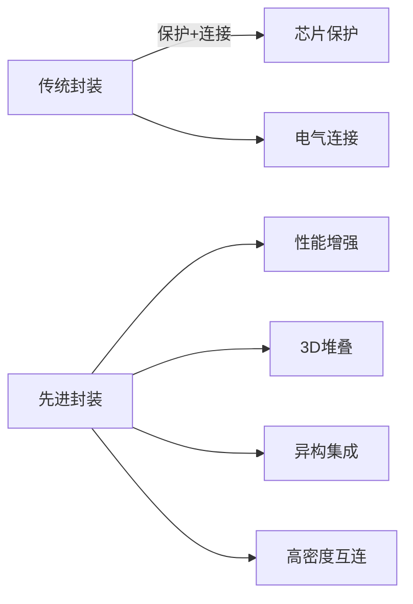

### 核心封装类型

| 封装类型 | 英文 | 核心特征 | 典型应用 |
|---------|------|---------|---------|
| 倒装芯片 | Flip Chip (FC) | 有源面朝下，凸点连接 | 高端GPU、CPU |
| 晶圆级封装 | WLP | 先封后切，尺寸最小 | 移动处理器 |
| 2.5D封装 | 2.5D | 硅中介层+TSV+RDL | HBM+GPU |
| 3D封装 | 3D IC | 垂直堆叠，TSV导通 | HBM、CIS |
| 系统级封装 | SiP | 多芯片同封装 | 射频、IoT |
| 芯粒 | Chiplet | 模块化SoC拆分 | 高性能计算 |

> [!tip] 先进封装的核心价值
> 1. **突破物理极限**：延续摩尔定律的主要路径
> 2. **带宽提升**：解决"内存墙"问题
> 3. **功耗降低**：互连距离缩短
> 4. **成本优化**：Chiplet提升良率、降低制造成本

---

## 1.2 为什么需要先进封装 | Why Advanced Packaging

### 三大驱动力

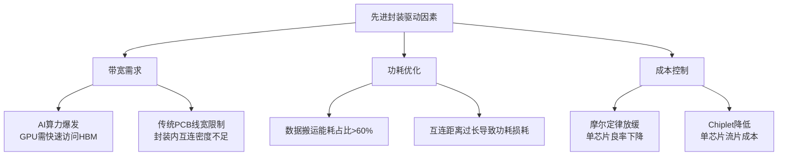

### 带宽墙问题 | Memory Wall

> [!warning] 核心矛盾
> - HBM3E带宽: **1.2 TB/s**
> - AI芯片实际需求: **4-10 TB/s**
> - 差距: **3-8倍**

解决方案：
1. 增加HBM堆叠层数（8层→12层→16层→20层）
2. 从2.5D走向3D堆叠
3. Compute-in-Memory (CiM) 架构

---

## 1.3 异构集成 | Heterogeneous Integration

> [!note] 术语说明
> "异构集成"是业界最混乱的术语之一，各家定义不一。本知识库将其定义为：**在单一封装内集成多个不同功能的元件（芯片/芯粒/无源器件）**。

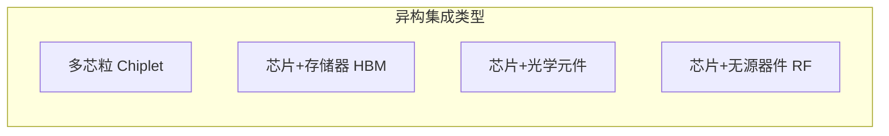

---

# 第二部分：封装类型与技术

## 2.1 封装外形分类 | Package Types

### 2.1.1 按安装方式

| 类型 | 英文 | 特征 |
|------|------|------|
| 通孔式 | Through-hole | 针脚穿过PCB孔，廉价但占用空间大 |
| 表面贴装 | Surface-mount (SMT) | 无需穿孔，密度更高，主流 |

### 2.1.2 按引脚形式

| 类型 | 英文 | 特征 |
|------|------|------|
| 边缘引脚 | Edge leads | 芯片四周引出 |
| 引脚阵列 | Lead arrays | BGA/CGA/LGA，底部阵列 |

### 2.1.3 先进封装组件层次

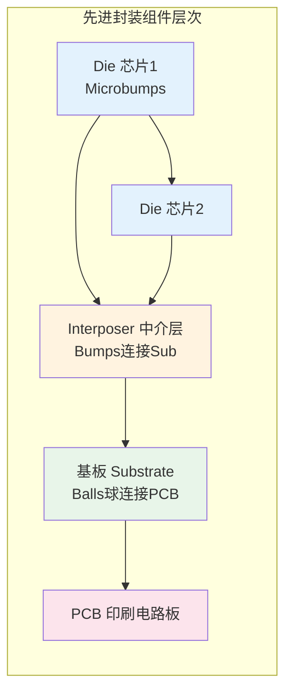

---

## 2.2 键合技术演进 | Bonding Technology Evolution

> [!success] 技术路线图
> **引线键合** → **C4凸块** → **热压键合(TCB)** → **铜柱** → **混合键合(Hybrid Bonding)**

### 键合技术对比表

| 技术 | Pitch (μm) | 直径 (μm) | 主要应用 | 成本 |
|------|-----------|-----------|---------|------|
| 引线键合 | 50-100 | 25-50 | 传统封装 | 低 |
| C4 Bump | 300-500 | 250-800 | 倒装芯片 | 中 |
| TCB Pillars | 50-150 | 50-100 | 高端倒装 | 高 |
| 铜柱 | 10-50 | 30 | 先进封装 | 高 |
| **混合键合** | **0.4** | **-** | **3D堆叠** | **极高** |

### 2.2.1 混合键合 | Hybrid Bonding (Cu-Cu Direct)

> [!abstract] 核心原理
> 混合键合将**氧化物**和**金属**同时键合——两块芯片的**铜焊盘**直接接触，**氧化层**首先键合，金属随后连接，**无需焊料**。

**优势：**
- Pitch可达 **0.4 μm**（比 microbump 小100倍）
- 消除焊料寄生电容，功耗降低 30-50%
- 延迟降低 40%
- 带宽密度 >10 TB/mm²

**挑战：**
- 所有焊盘必须共面（<300nm平整度）
- 表面洁净度要求极高
- 良率约70-80%（远低于2.5D的90%+）

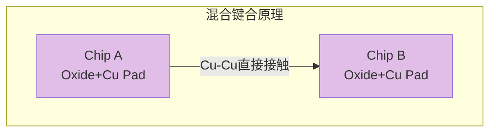

**市场预测：**
- Bonder设备市场规模：2025年 **1000亿日元** → 2030年 **3000亿日元**

---

## 2.3 Interposer材料 | Interposer Materials

### 四种Interposer对比

| 材料 | 优势 | 劣势 | 量产状态 |
|------|------|------|---------|
| **硅 Interposer** | 密度最高，TSMC主导 | 成本最高 | ✅ 已量产 |
| **玻璃 Interposer** | 低介电，尺寸大 | TGV工艺难 | 🔬研发中 |
| **有机 Interposer** | 成本低 | 密度受限 | 🔬早期量产 |
| **主动 Interposer** | 可集成晶体管 | 设计复杂 | 🚫未量产 |

### 2.3.1 硅桥 | Silicon Bridge

> [!note] Intel EMIB
> Intel的EMIB（Embedded Multi-Die Interconnect Bridge）是最知名的硅桥技术，将一小块硅片嵌入有机基板中，提供高密度die-to-die互连。

---

## 2.4 2D / 2.5D / 3D 封装对比

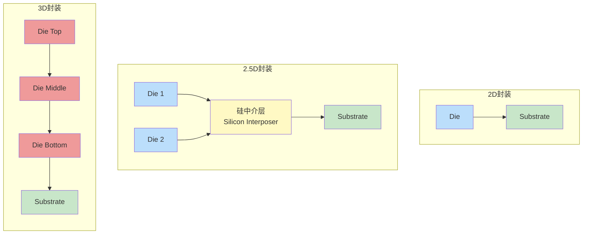

| 维度 | 2D | 2.5D | 3D |
|------|-----|------|-----|
| 芯片排列 | 水平 | 水平+中介层 | 垂直堆叠 |
| TSV | 无 | 有 | 有 |
| 带宽密度 | ~2 TB/mm² | ~2 TB/mm² | >10 TB/mm² |
| 代表技术 | 传统BGA | CoWoS, EMIB | Foveros, HBM堆叠 |
| 良率 | >95% | >90% | ~70-80% |

---

# 第三部分：核心制造工艺

## 3.1 基板 | Substrate

> [!info] 基板基础
> 基板是封装与PCB之间的桥梁，由**有机介质层**和**铜层**交替堆叠而成，结构类似HDI PCB。

**基板结构：**
```
┌─────────────────────┐
│   Die / Chip        │
├─────────────────────┤
│   Underfill         │
├─────────────────────┤
│   Substrate         │
│   ┌───────────────┐ │
│   │ Build-up层×N  │ │
│   ├───────────────┤ │
│   │ Core核心层    │ │
│   ├───────────────┤ │
│   │ Build-up层×N  │ │
│   └───────────────┘ │
├─────────────────────┤
│   Solder Balls → PCB│
└─────────────────────┘
```

**关键材料：**
- BT树脂 (Bismaleimide-Triazine)：成本低，但耐热性差
- ABF (Ajinomoto Build-up Film)：低介电常数，高性能

---

## 3.2 RDL | Redistribution Layer

> [!tip] RDL的作用
> RDL的核心功能是**重新分布I/O位置**——将芯片上紧密排列的焊盘通过金属线重新排布到更宽松的间距，以适配PCB焊接。

**RDL构建方式：**
1. 介质层沉积（ PECVD / 旋涂）
2. 金属层沉积（ PVD / 电镀）
3. 光刻/显影
4. 干法刻蚀
5. CMP平坦化

---

## 3.3 TSV | Through-Silicon Via

> [!warning] TSV是3D封装的核心
> TSV（硅通孔）在硅芯片中刻蚀垂直通孔，通过绝缘层、阻挡层、种子层、镀铜填充，实现芯片垂直方向的电气互连。

### TSV工艺流程

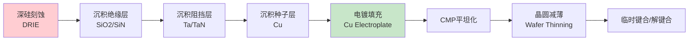

### TSV关键供应商

| 工艺步骤 | 核心供应商 |
|---------|----------|
| 深硅刻蚀 | SPTS (KLA), Plasma-Therm |
| 沉积设备 | AMAT, Lam, TEL |
| CMP | AMAT, Ebara |
| 键合设备 | EV Group, SUSS MicroTec |

---

## 3.4 Bumping | 凸块制作

### 工艺流程

```
晶圆清洗 → UBM沉积 → 光刻 → 焊料沉积 → 回流焊 → 检测
```

### 焊料类型

| 类型 | 成分 | 熔点 | 应用 |
|------|------|------|------|
| 高铅焊料 | SnPb | 183°C | 军事/航天 |
| SAC系列 | SnAgCu | 217°C | 主流 |
| 低温焊料 | SnBi | 139°C | 热敏感元件 |

---

## 3.5 底部填充 | Underfill

> [!question] 为什么需要Underfill？
> 倒装芯片中，芯片与基板之间存在微间隙（约20-50μm），底部填充材料用于**填充间隙、增强机械连接、分散热应力**，防止焊点疲劳失效。

**主要材料供应商：**
- Henkel（德国）— 全球领导者
- Namihaya（日本）— 底部填充专业
- Panasonic（日本）— 环氧塑封+底部填充

---

# 第四部分：HBM与存储封装

## 4.1 HBM技术演进 | HBM Evolution

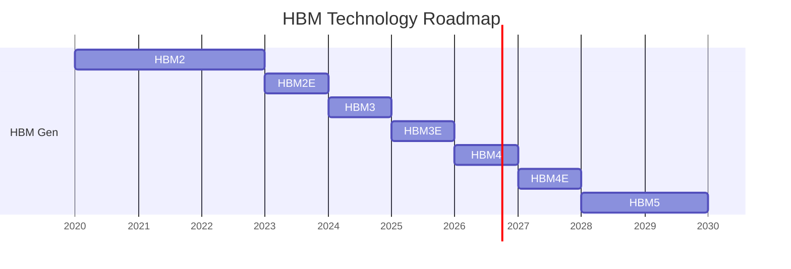

| 世代 | 带宽 | 单堆叠容量 | 层数 | 键合方式 | 时间 |
|------|------|-----------|------|---------|------|
| HBM2 | 256 GB/s | 8GB | 8层 | Microbump | 2016 |
| HBM2E | 326 GB/s | 16GB | 12层 | Microbump | 2020 |
| HBM3 | 819 GB/s | 24GB | 16层 | Microbump | 2022 |
| HBM3E | 1.2 TB/s | 36GB | 16层 | Microbump | 2024 |
| HBM4 | ~1.5 TB/s | 64GB+ | 16-20层 | Microbump/W2W | 2026 |
| HBM4E | ~2.0 TB/s | 96GB+ | 16-20层 | Hybrid Bonding | 2027 |
| HBM5 | >2.5 TB/s | 128GB+ | 20层+ | Hybrid Bonding | 2028+ |

**市场预测（Yole）：**
- 2024年：**170亿美元**
- 2030年：**980亿美元**
- CAGR：**33%**

---

## 4.2 3D DRAM路线图 | 3D DRAM Roadmap

### GPU-DRAM集成三阶段

| 阶段 | 时间 | 技术 | 带宽密度 |
|------|------|------|---------|
| **阶段一：2.5D扩容** | 2024-2026 | HBM3E + CoWoS-L | ~2 TB/mm² |
| **阶段二：局部3D** | 2027-2029 | GPU堆叠SRAM + Hybrid Bonding | ~6 TB/mm² |
| **阶段三：全3D** | 2030+ | HBM直连GPU + CiM | >10 TB/mm² |

### 海外厂商路线

| 厂商 | 当前技术 | 3D时间表 | 战略 |
|------|---------|---------|------|
| **NVIDIA** | CoWoS + HBM3E | 2026局部3D<br/>2030全3D | 保守，蓄势待发 |
| **Intel** | Foveros Direct | **2027全3D** | 最激进 |
| **AMD** | MI300X 3D V-Cache | 2025-2026 | Chiplet+3D |
| **SK海力士** | HBM3E MR-MUF | 2026 HBM4<br/>2027 HBM4E HB | HB先行 |
| **三星** | X-Cube | 2025 HBM4 | NCF+HCB |

### 3D DRAM核心挑战

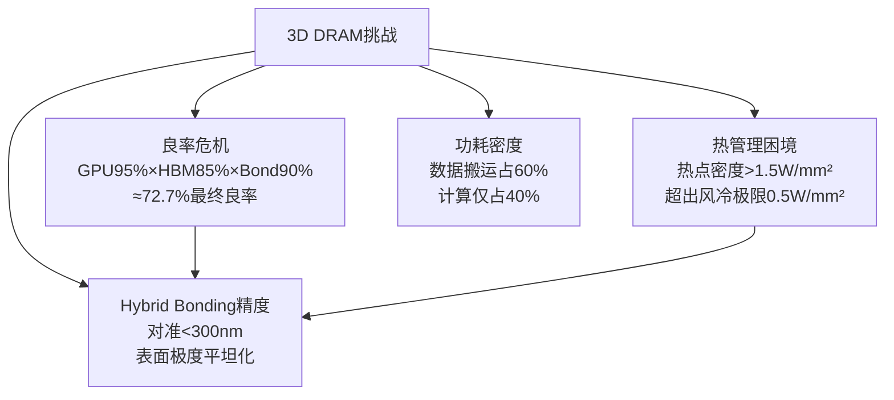

---

## 4.3 国产存储动态 | China Memory Players

### 长鑫存储 (CXMT)

| 维度 | 现状 |
|------|------|
| 技术 | HBM3E验证中 |
| 特色 | 横向堆叠简化垂直整合工艺 |
| 战略 | CBA分离键合+4F²架构 |

### 长江存储 (YMTC)

| 维度 | 现状 |
|------|------|
| 技术 | Xtacking® 异构堆叠 |
| 突破 | 232层3D NAND量产 |
| 趋势 | Xtacking → HBM4预研 |

### 关键机会

> [!success] 国产3D DRAM机遇
> 3D DRAM更依赖**刻蚀、薄膜、键合**等技术，而非EUV光刻。中国厂商在成熟制程设备上的积累，有望在3D DRAM时代实现弯道超车。

---

# 第五部分：材料与设备

## 5.1 关键材料

| 材料类别 | 关键供应商 | 国产替代 |
|---------|----------|---------|
| 环氧塑封料 (EMC) | Sumitomo Bakelite, Panasonic | 宏昌电子, 华海诚科 |
| 底部填充 (Underfill) | Henkel, Namihaya | 德高化成, 烟台德邦 |
| ABF积层膜 | Ajinomoto | 暂无成熟替代 |
| 感光聚酰亚胺 (PI) | JSR, Hitachi Chemical | 鼎龙控股, 德高化成 |
| 焊锡球 | Senju Metal, MK Electron | 尽快电子 |
| 电镀液 | MacDermid, Uyemura | 星星科技 |
| 临时键合胶 | 3M, Brewer Science | 飞凯材料 |
| 靶材 (Cu/Ta) | Mitsui Mining, JX Advanced | 江丰电子 |

## 5.2 关键设备

| 设备类别 | 全球龙头 | 国产替代 |
|---------|---------|---------|
| 沉积 PVD/CVD | AMAT, Lam, TEL | 北方华创, 中微公司 |
| 刻蚀 | Lam, TEL, SPTS | 中微公司 |
| CMP | AMAT, Ebara | 华海清科 |
| 键合 (Hybrid) | EVG, Besi | 华海清科 |
| 研磨/切割 | Disco | 华卓精科 |
| AOI检测 | Camtek, KLA | 中科飞测, 精测电子 |
| 光刻 | ASML, Canon | 上海微电子(SMEE) |

---

# 第六部分：市场与产业链

## 6.1 市场规模 | Market Size

### 全球先进封装市场

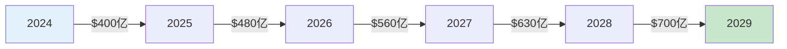

### 中国先进封装市场

| 年份 | 市场规模 | 增速 |
|------|---------|------|
| 2024 | 513亿元 | - |
| 2025 | 600亿元 | +17% |
| 2026 | 720亿元 | +20% |
| 2027 | 850亿元 | +18% |
| 2029 | >1000亿元 | - |

### 全球封装设备市场（2025预测）

| 细分领域 | 市场规模 | 主要厂商 |
|---------|---------|---------|
| 键合设备 | $15亿+ | ASM Pacific, Besi, Kulicke & Soffa |
| 检测设备 | $12亿+ | KLA, Camtek |
| 减薄设备 | $8亿+ | Disco, GKG |

---

## 6.2 竞争格局 | Competitive Landscape

### 全球竞争格局

```mermaid
graph TD
    subgraph 全球先进封装阵营
        direction TB
        
        subgraph 晶圆厂阵营
            TSMC[台积电<br/>CoWoS, InFO]
            Samsung[三星电子<br/>FOPLP, X-Cube]
            Intel[英特尔<br/>Foveros, EMIB]
        end
        
        subgraph OSAT阵营
            ASE[日月光 ASE<br/>FOCoS, SiP]
            JCET[长电科技<br/>2.5D/3D封装]
            TFME[通富微电<br/>AMD合作]
            HUADA[华天科技]
        end
    end
    
    TSMC -->|CoWoS| NVIDIA
    TSMC -->|InFO| Apple
    Samsung -->|X-Cube| 自家Exynos
    Intel -->|Foveros| Lunar Lake
    JCET -->|先进封装| 国内AI芯片
    TFME -->|Chiplet| AMD MI300
```

### 国内竞争格局

| 梯队 | 企业 | 定位 |
|------|------|------|
| **第一梯队** | 长电科技、通富微电、华天科技 | 规模领先，全制程覆盖 |
| **第二梯队** | 中科飞测、精测电子、晶方科技 | 细分领域突破 |
| **第三梯队** | 中微公司、北方华创、华海清科 | 设备端国产替代 |

---

# 第七部分：技术挑战

## 7.1 五大核心挑战

> [!danger] 先进封装五大技术挑战

### 1. 高密度互连良率困境

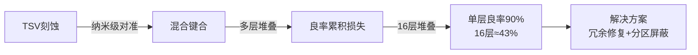

### 2. 翘曲与热机械应力

- CTE（热膨胀系数）失配：硅(~2.6ppm) vs 有机基板(~15-25ppm)
- 界面分层、焊点开裂风险
- 解决：渐变CTE材料设计、热仿真

### 3. 热管理极限

| 散热方案 | 现状 | 挑战 |
|---------|------|------|
| 风冷 | 极限0.5W/mm² | 无法满足高端GPU |
| 液冷 | 逐步采用 | 增加成本和复杂度 |
| 金刚石TIM | 研发中 | 成本极高 |
| 背面冷却 | 3D必备 | 工艺复杂 |

### 4. 信号完整性

- 高速信号串扰（尤其HBM/PAM4）
- 长互连延迟（2.5D中继层布线~10mm）
- 电源完整性（PDN设计挑战）

### 5. 测试与可靠性

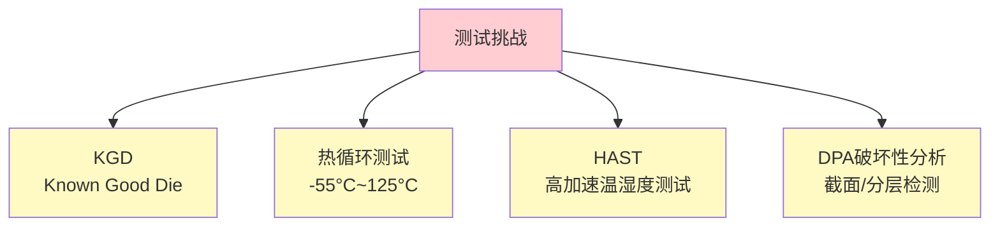

---

# 附录：知识图谱关联

## 相关笔记

- [[HBM-Technology-Roadmap]] — HBM与3D DRAM技术路线图（独立笔记）
- [[Chiplet-Industry-Map]] — Chiplet产业地图（独立笔记）
- [[Semiconductor-Equipment-Map]] — 半导体设备供应商图谱（独立笔记）
- [[China-Memory-Industry]] — 中国存储产业分析（独立笔记）

## 参考来源

- [Advanced Packaging Fundamentals](D:\raw date\js\Advanced-Packaging-Fundamentals-ebook-2025.pdf), Semiconductor Engineering, 2025
- [2026年中国半导体先进封装行业研究报告](C:\Users\Yujie Tang\Desktop\存储\2026年中国半导体先进封装行业研究报告【行行查-hanghangcha.com】.pdf), 行行查, 2026
- [国泰海通证券-电子封装与键合技术](C:\Users\Yujie Tang\Desktop\存储\国泰海通证券-产业专题：电子封装与键合技术，制程产业的最后一步-251119.pdf), 2025
- [中泰证券-4F2+CBA架构DRAM专题](C:\Users\Yujie Tang\Desktop\存储\中泰证券-电子行业：4F2+CBA是国产DRAM大趋势-251130.pdf), 2025
- [国盛证券-存储产业升级](C:\Users\Yujie Tang\Desktop\存储\【国盛郑震湘团队】存储产业升级：重视HBM、3D DRAM、定制化存储机遇.pdf), 2025

---

> [!cite] 引用格式
> ```
> Advanced Packaging Knowledge Base. (2026). Based on Advanced Packaging 
> Fundamentals (Semiconductor Engineering, 2025) and 2026年中国半导体先进封装
> 行业研究报告 (行行查, 2026).
> ```
